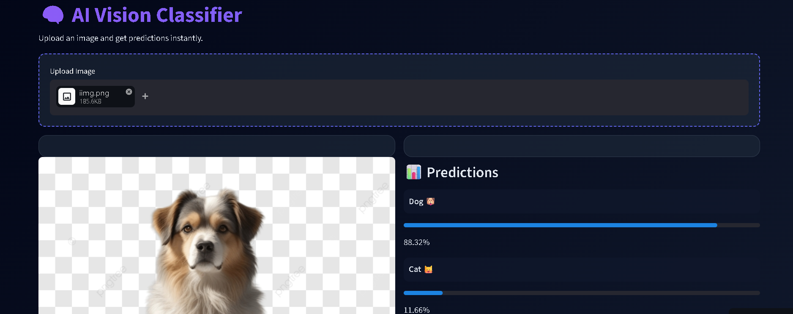
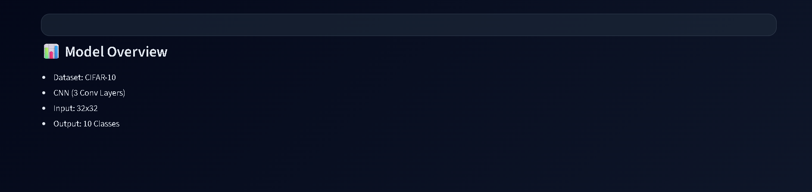

# 🧠 AI Vision Classifier (CIFAR-10)

A modern deep learning web application that classifies images into 10 categories using a Convolutional Neural Network (CNN). Built with **PyTorch** and deployed using **Streamlit** with a clean dark SaaS-style UI.

---

## 🚀 Live Demo
👉https://aivisionclassifier-kq53vzcgdtltojswpplcus.streamlit.app

---

## 📸 App Preview





---

## 🧠 Features

* 🎯 Real-time image classification
* 📊 Top-K predictions with confidence scores
* 🌙 Modern dark-themed UI (SaaS style)
* ⚡ Fast inference with optimized model loading
* 📂 Easy image upload support
* 📈 Clean and interactive user experience

---

## 🏗️ Tech Stack

* **Deep Learning:** PyTorch
* **Frontend/UI:** Streamlit
* **Dataset:** CIFAR-10
* **Image Processing:** PIL, Torchvision

---

## 🧠 Model Details

* Custom CNN Architecture (3 Convolution Layers)
* Input Size: 32×32
* Output: 10 Classes
* Loss Function: CrossEntropyLoss
* Optimizer: Adam

---

## 📊 Classes

* ✈️ Airplane
* 🚗 Automobile
* 🐦 Bird
* 🐱 Cat
* 🦌 Deer
* 🐶 Dog
* 🐸 Frog
* 🐴 Horse
* 🚢 Ship
* 🚚 Truck

---

## 📁 Project Structure

```
project/
│
├── app.py
├── cifar10_cnn.pth
├── requirements.txt
├── README.md
```

---

## 🧪 How to Use

1. Upload an image (JPG/PNG)
2. Model processes the image
3. View predictions with confidence scores

---

## 📈 Improvements Made

* Applied **data normalization and augmentation**
* Enhanced CNN with **Batch Normalization & Dropout**
* Implemented **Top-K prediction system**
* Designed a **modern UI for better user experience**

---

## 🎯 Limitations

* Works best on single-object images
* Performance may drop on complex real-world images
* Limited by CIFAR-10 resolution (32×32)

---

## 🚀 Future Improvements

* 🔥 Transfer Learning (ResNet / MobileNet)
* 📊 Accuracy & Loss Visualization
* 🧠 Grad-CAM Explainability
* 🌐 Full-stack deployment (React + FastAPI)

---

## 👨‍💻 Author

**Ankit Gupta**
   - AIML Engineer 
